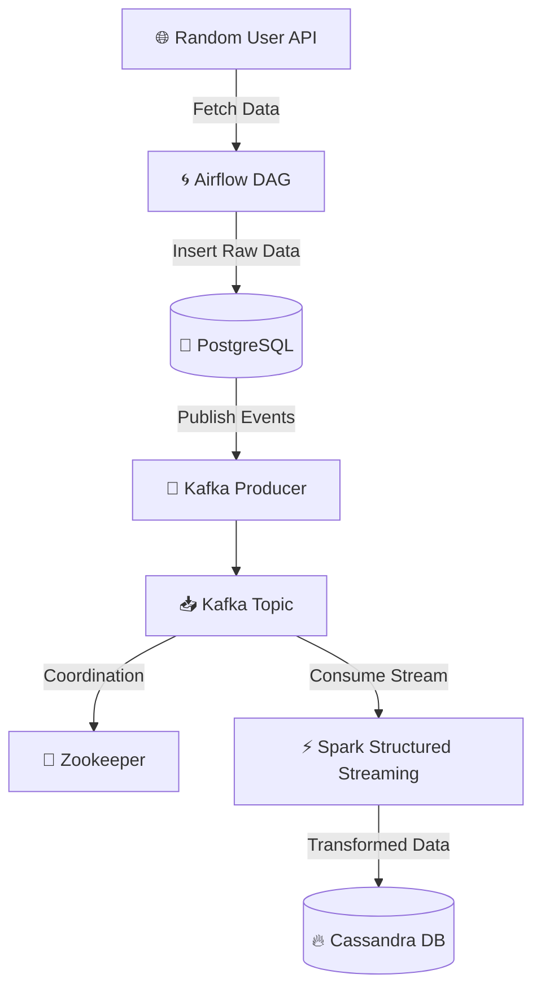

# 🚀 Automated User Insights Pipeline  

A **real-time data engineering pipeline** that fetches 👨‍💻, streams 🔄, processes ⚡, and stores 📦 user data—powered by **Airflow, Kafka, Spark, PostgreSQL, and Cassandra**.  

---

## 📝 About the Project  

The **Automated User Insights Pipeline** simulates a **real-time analytics platform**. It automates **data ingestion, streaming, processing, and storage** to demonstrate modern data engineering practices.  

---

## ✨ Features  

✔️ **Scheduled Data Ingestion** with Airflow (Random User API → PostgreSQL)  
✔️ **Event-Driven Streaming** with Kafka & Zookeeper  
✔️ **Real-Time Processing** using Spark Structured Streaming  
✔️ **High-Speed Storage** in Cassandra for analytics  
✔️ **Fault-Tolerant & Scalable** design  

---

## 🛠 Tech Stack  

| Layer                  | Technology 🚀               |
|------------------------|-----------------------------|
| Orchestration          | Apache Airflow 🌀           |
| API Integration        | Python 🐍                   |
| Staging Storage        | PostgreSQL 🐘               |
| Streaming Broker       | Apache Kafka 🦄 + Zookeeper 🦓 |
| Stream Processing      | Apache Spark ⚡              |
| Final Storage          | Apache Cassandra 🔥          |

---

## ​ Project Workflow

1. **Airflow** triggers an HTTP call to fetch random user data from the API.  
2. This raw data is saved in **PostgreSQL** as a staging layer.  
3. A **Kafka producer** monitors PostgreSQL for new entries and publishes them to a Kafka topic.  
4. **Zookeeper** handles Kafka's cluster coordination and stability.  
5. **Spark Structured Streaming** reads from Kafka, then performs transformations (cleansing, formatting, enrichment).  
6. Final records are inserted into **Cassandra**, ready for efficient analytics and querying.  
7. The provided architecture diagram offers a visual walkthrough of this flow.

Here’s how data flows through the pipeline:  



---

##  Installation & Setup

### Prerequisites

Ensure these are installed and accessible in your environment:

- Python 3.x  
- PostgreSQL  
- Apache Kafka & Zookeeper  
- Apache Spark 3.x  
- Apache Cassandra

### Getting Started

```bash
# 1. Clone the repository
git clone https://github.com/KingRK786/Automated_User_Analytics_Pipeline.git
cd Automated_User_Analytics_Pipeline

# 2. Install Python dependencies
pip install -r requirements.txt

# 3. Configure services
# - Launch PostgreSQL and create a suitable database/schema for ingestion
# - Start Kafka broker and Zookeeper cluster
# - Create and run necessary Kafka topics
# - Spin up a Cassandra node and prepare schema (keyspace, tables)

# 4. Run the setup
# - Launch your Airflow scheduler & webserver to execute the ingestion DAG
# - Kick off the Python Kafka producer to stream PostgreSQL changes
# - Launch the Spark streaming job:
spark-submit --jars spark-sql-kafka-0-10_2.12-3.4.1.jar spark_stream.py

# 5. Confirm Data Flow
# Check PostgreSQL for staged data
# Inspect Kafka topic stream
# Validate Spark has processed and written to Cassandra
```
